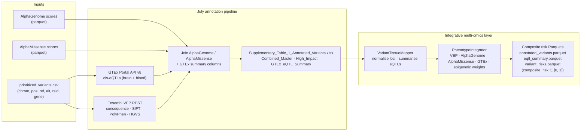

# IBAR-ROGEN Aging

Computational pipelines for longevity-associated genomic and epigenetic analysis under the IBAR-ROGEN consortium. The repository provides reproducible tooling for epigenetic clock training and external validation, public-frequency LA-SNP workflows, prioritized-variant functional annotation (GTEx v8, Ensembl VEP, AlphaGenome / AlphaMissense), and offline integrative variant×tissue×phenotype risk scoring.

**Requirements:** Python ≥ 3.12 · dependency management via [uv](https://docs.astral.sh/uv/)  
**License:** MIT — see [LICENSE](LICENSE)  
**Citation:** [`CITATION.cff`](CITATION.cff)

---

## Project Overview

Installable code lives under `src/rogen_aging/`. Console entry points are registered in [`pyproject.toml`](pyproject.toml). Detailed workflow guides are maintained in [`docs/`](docs/WORKFLOWS.md).

| Package | Role |
|---------|------|
| `rogen_aging.clock` | ElasticNet DNAm-age clocks (train, evaluate, external cohort loaders) |
| `rogen_aging.ukb` | LA-SNP manifests, 1KG / gnomAD allele-frequency comparison, synthetic UKB-RAP fixtures |
| `rogen_aging.ukb_integration` | Synthetic phenotype–genotype joins and LA-SNP association summaries |
| `rogen_aging.integrative` | Offline variant×tissue×phenotype joins and composite risk scoring |
| `rogen_aging.vcf` | Synthetic Romanian VCF generation for pipeline testing |
| `rogen_aging.eda_dashboard` | Streamlit EDA on merged mock clinical / epigenetic-age tables |
| `rogen_aging.cli` | Typer wrappers (`rogen-clock`, `rogen-ukb-manifest`, `rogen-ukb-integrate`, …) |

**Glossary.** `ukb_integration` denotes synthetic UK Biobank RAP phenotype/genotype joins. `integrative` denotes the offline multi-source variant×tissue×phenotype risk layer (not UKB RAP).

Primary analysis tracks documented in this hub:

| Track | Guide |
|-------|-------|
| July prioritized-variant annotation | [docs/JULY_ANNOTATION_PIPELINE.md](docs/JULY_ANNOTATION_PIPELINE.md) |
| Methylation clock validation (GSE87571) | [docs/METHYLATION_CLOCK_VALIDATION.md](docs/METHYLATION_CLOCK_VALIDATION.md) |
| Nomenclature reconciliation & figures | [docs/NOMENCLATURE_RECONCILE_FIGURES.md](docs/NOMENCLATURE_RECONCILE_FIGURES.md) |
| Integrative composite-risk pipeline | [docs/INTEGRATIVE_PIPELINE.md](docs/INTEGRATIVE_PIPELINE.md) |

---

## Installation

Install [uv](https://docs.astral.sh/uv/), then resolve the project environment (including development extras for linting and tests):

```bash
curl -LsSf https://astral.sh/uv/install.sh | sh
uv sync --extra dev
uv run pytest
```

Optional Jupyter kernel:

```bash
uv run python -m ipykernel install --user --name rogen-aging --display-name "Python (rogen-aging)"
uv run jupyter lab
```

Install the pre-commit framework (Black, isort, flake8, mypy, genomics schema
check, and UK Biobank security). See [docs/CONTRIBUTING.md](docs/CONTRIBUTING.md).

```bash
./scripts/dev/install_pre_commit_hook.sh
# equivalent: uv sync --extra dev && uv run pre-commit install
```

Continuous integration (`.github/workflows/ci.yml`) runs `uv sync --extra dev`, `ruff`, `pytest`, and the UKB compliance audit on every push or pull request to `main`. Audit rules are documented in [docs/UKBB_CI_COMPLIANCE_AUDIT.md](docs/UKBB_CI_COMPLIANCE_AUDIT.md).

---

## Quickstart

Console scripts are invoked with `uv run`. Full command tables and activity maps live in [docs/WORKFLOWS.md](docs/WORKFLOWS.md).

### Epigenetic clock

```bash
uv run rogen-clock train \
  --input_data data/gse40279.parquet \
  --output_model analysis/gse40279_elasticnet_clock.pkl \
  --output_metrics analysis/gse40279_train_metrics.json

uv run rogen-clock evaluate \
  --model_path analysis/gse40279_elasticnet_clock.pkl \
  --test_data data/gse87571.parquet \
  --output_dir figures/validation_gse87571

# Publication metrics + three-panel figure (see INPUT_MANIFEST.md)
uv run python scripts/clock/evaluate_methylation_clock.py
```

See [docs/METHYLATION_CLOCK_VALIDATION.md](docs/METHYLATION_CLOCK_VALIDATION.md) and [INPUT_MANIFEST.md](INPUT_MANIFEST.md).

### Prioritized-variant annotation and integrative risk

```bash
# GTEx v8 + Ensembl VEP + AlphaGenome / AlphaMissense → supplementary workbook
uv run python scripts/ukb/run_july_annotation_pipeline.py
# → outputs/Supplementary_Table_1_Annotated_Variants.xlsx

# Offline variant × tissue × phenotype composite risk
uv run python scripts/integrative/run_pipeline.py
# → analysis/integrative/results/{annotated_variants,eqtl_summary,variant_risks}.parquet
```

See [docs/JULY_ANNOTATION_PIPELINE.md](docs/JULY_ANNOTATION_PIPELINE.md) and [docs/INTEGRATIVE_PIPELINE.md](docs/INTEGRATIVE_PIPELINE.md).

### UK Biobank LA-SNP (public data only)

```bash
uv run rogen-ukb-manifest build --input overlapping_genes_with_snps.xlsx \
  --output analysis/ukb_snp_manifest_v0.1.csv
uv run rogen-compare-af-gnomad \
  --input analysis/la_snp_1kg_frequencies.csv \
  --output analysis/la_snp_af_1kg_vs_gnomad.csv
uv run rogen-ukb-mock-rap --n-samples 1000 --output-dir test_data/mock_ukb_rap/
uv run rogen-ukb-integrate --output-dir analysis/
```

### Nomenclature reconciliation

```bash
uv run python scripts/figures/reconcile_and_generate_figures.py
```

See [docs/NOMENCLATURE_RECONCILE_FIGURES.md](docs/NOMENCLATURE_RECONCILE_FIGURES.md).

---

## Pipeline Architecture

The end-to-end prioritized-variant path starts from a curated locus table, enriches each variant with tissue eQTL evidence, transcript consequences, and sequence-model scores, then aggregates channel scores into a bounded composite risk used for ranking and optional sample-level profiles.



Default risk-channel weights are VEP 0.25, AlphaGenome 0.25, AlphaMissense 0.25, GTEx 0.15, and epigenetic 0.10 ([docs/INTEGRATIVE_PIPELINE.md](docs/INTEGRATIVE_PIPELINE.md)). Live GTEx / VEP fetching is confined to the July annotation stage; the integrative module consumes tables only.

| Stage | Entry point | Primary outputs |
|-------|-------------|-----------------|
| Functional annotation | `scripts/ukb/run_july_annotation_pipeline.py` | `outputs/Supplementary_Table_1_Annotated_Variants.xlsx` (+ optional parquet siblings) |
| Tissue map & composite risk | `scripts/integrative/run_pipeline.py` | `analysis/integrative/results/*.parquet` |

---

## Documentation Index

### Core pipelines

| Topic | Document |
|-------|----------|
| July prioritized-variant annotation (GTEx · VEP · Alpha scores) | [docs/JULY_ANNOTATION_PIPELINE.md](docs/JULY_ANNOTATION_PIPELINE.md) |
| Integrative variant×tissue×phenotype risk | [docs/INTEGRATIVE_PIPELINE.md](docs/INTEGRATIVE_PIPELINE.md) |
| Methylation clock validation (GSE87571) | [docs/METHYLATION_CLOCK_VALIDATION.md](docs/METHYLATION_CLOCK_VALIDATION.md) |
| Nomenclature reconciliation & manuscript figures | [docs/NOMENCLATURE_RECONCILE_FIGURES.md](docs/NOMENCLATURE_RECONCILE_FIGURES.md) |

### Navigation and reference

| Topic | Document |
|-------|----------|
| Workflow index | [docs/WORKFLOWS.md](docs/WORKFLOWS.md) |
| Activity map | [docs/ACTIVITIES.md](docs/ACTIVITIES.md) |
| Code reference | [docs/CODE_MODULES_REFERENCE.md](docs/CODE_MODULES_REFERENCE.md) |
| Directory layout | [docs/PROJECT_STRUCTURE.md](docs/PROJECT_STRUCTURE.md) |
| Input path manifest | [INPUT_MANIFEST.md](INPUT_MANIFEST.md) |
| Manuscript figures | [docs/FIGURES.md](docs/FIGURES.md) |

### Domain guides

| Topic | Document |
|-------|----------|
| Epigenetic clock library | [docs/CLOCK_LIBRARY.md](docs/CLOCK_LIBRARY.md) · [GSE40279 training](docs/GSE40279_CLOCK_TRAINING.md) · [eval figures](docs/CLOCK_EVAL_FIGURES.md) · [Romanian clock](docs/ROMANIAN_EPIGENETIC_CLOCK.md) |
| LA-SNP VEP / GTEx annotation | [docs/LA_SNP_VEP_ANNOTATION.md](docs/LA_SNP_VEP_ANNOTATION.md) · [docs/LA_SNP_GTEX_ANNOTATION.md](docs/LA_SNP_GTEX_ANNOTATION.md) |
| LA-SNP public allele-frequency validation | [docs/LA_SNP_PUBLIC_FREQUENCY_PIPELINE.md](docs/LA_SNP_PUBLIC_FREQUENCY_PIPELINE.md) · [AF figures](docs/AF_COMPARISON_FIGURES.md) |
| Genomics validation (GRCh38) | [docs/GENOMICS_ANALYSIS.md](docs/GENOMICS_ANALYSIS.md) |
| Synthetic UKB integration | [docs/UKB_INTEGRATION_PIPELINE.md](docs/UKB_INTEGRATION_PIPELINE.md) · [generators](docs/SYNTHETIC_UKB_GENERATOR.md) · [RAP fixtures](docs/SYNTHETIC_UKB_RAP_GENERATOR.md) |
| Synthetic Romanian VCF | [docs/SYNTHETIC_ROMANIAN_VCF_GENERATOR.md](docs/SYNTHETIC_ROMANIAN_VCF_GENERATOR.md) |
| Methylation (Oxford Nanopore) pipeline | [docs/METHYLATION_PIPELINE_README.md](docs/METHYLATION_PIPELINE_README.md) · [usage](docs/METHYLATION_PIPELINE_USAGE.md) · [quick reference](docs/METHYLATION_PIPELINE_QUICK_REFERENCE.md) |
| EDA dashboard | [docs/EDA_DASHBOARD.md](docs/EDA_DASHBOARD.md) · [mock integration](docs/EDA_MOCK_INTEGRATION.md) |
| AlphaGenome analysis notes | [docs/ALPHAGENOME_ANALYSIS_EXPLANATION.md](docs/ALPHAGENOME_ANALYSIS_EXPLANATION.md) |
| UKB CI compliance audit | [docs/UKBB_CI_COMPLIANCE_AUDIT.md](docs/UKBB_CI_COMPLIANCE_AUDIT.md) · [auditor](docs/UKB_COMPLIANCE_AUDITOR.md) · [pre-commit hook](docs/UKB_PRE_COMMIT_HOOK.md) |
| Contributing (hooks, git workflow) | [CONTRIBUTING.md](CONTRIBUTING.md) · [docs/CONTRIBUTING.md](docs/CONTRIBUTING.md) |

---

## Citation

If you use this repository, please cite the IBAR-ROGEN Aging software (see [`CITATION.cff`](CITATION.cff)) and any relevant manuscript or activity reports for the analyses you reuse.

## License

MIT — see [LICENSE](LICENSE).
